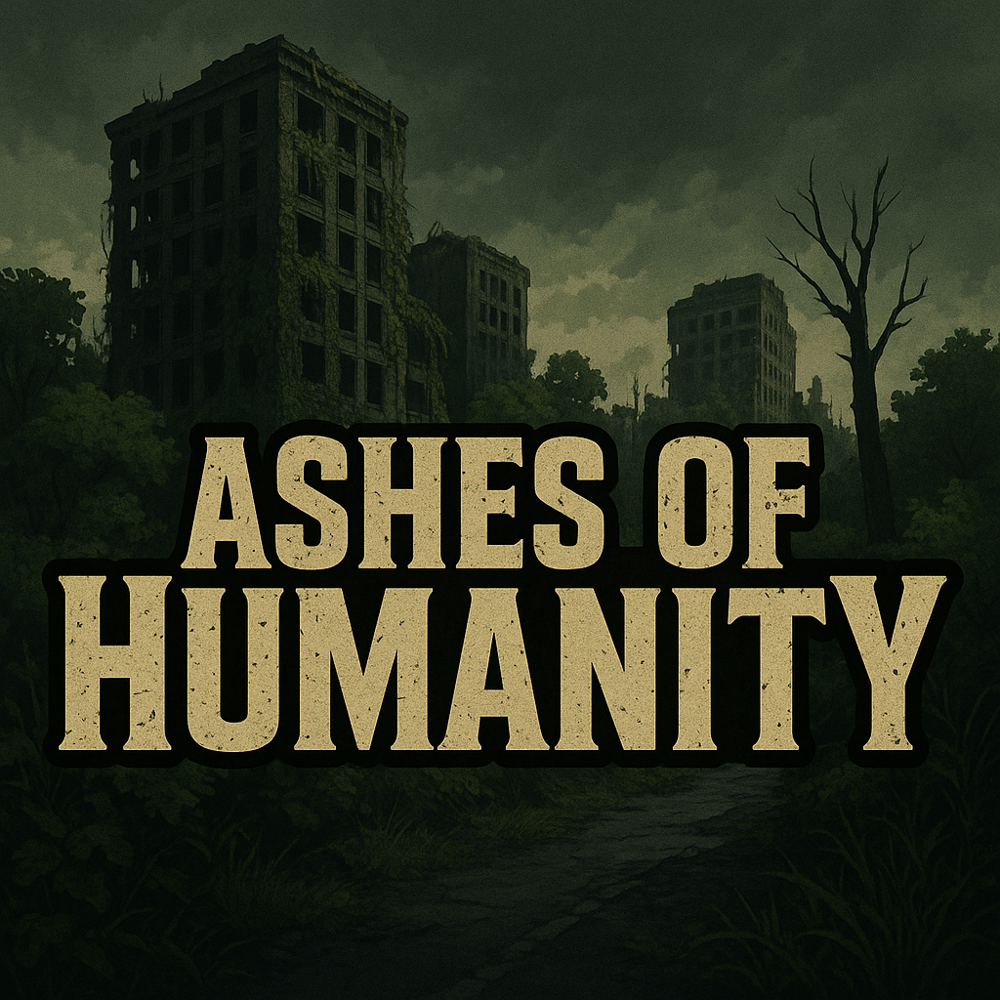

<p align="center">
  <a href="" rel="noopener">
 </a>
</p>

<h3 align="center">Ashes of Humanity</h3>

<div align="center">

[]()
[](https://github.com/kylelobo/The-Documentation-Compendium/issues)
[](https://github.com/kylelobo/The-Documentation-Compendium/pulls)
[](/LICENSE)

</div>

---

<p align="center"> Ashes of Humatity is an aventure game where you play as a survivor in a post-apocalyptic world. You must navigate through the ruins of civilization, scavenge for resources, and make choices that will determine your fate. The game features a rich narrative, branching paths, and multiple endings based on your decisions.
    <br> 
</p>

## 📝 Table of Contents

- [About](#about)
- [Getting Started](#getting_started)
- [Compilation](#compilation)
- [Usage](#usage)
- [Built Using](#built_using)
- [Authors](#authors)

## 🧐 About <a name = "about"></a>

This project is a game that lets players discover a post-apocalyptic world through the eyes of a survivor. The aim of the game is to get out of the city while surviving the various obstacles that stand in the survivor's way (monsters, etc.).
## 🏁 Getting Started <a name = "getting_started"></a>

These instructions will get you a copy of the project up and running on your local machine for development.

### Prerequisites

To install this project, you need to have the following software installed on your machine:

```
Install Javafx 21LTS
```

### Installing

Firts, download the repository:

```
https://github.com/c0opycat/projet_poo2
```

Then, you can unzip the file.<br>

## 🔨 Compilation <a name = "compilation"></a>

To compile the project, you need to have JavaFX installed on your machine.<br>
You can download it from the [JavaFX website](https://www.azul.com/).<br>

Then you can go to the main folder of the project and run the following command:

```
./compile.sh
```
If you have a local JavaFX installation, you need to modify the compile.sh file to add the path of your JavaFX installation.<br>
To do this:<br>
 - Open the main folder.<br>
 - Edit the file "compile.sh" to add the path of your JavaFX installation.<br>
 - Replace the line with a comment : #replace this line with the path to your javafx compiler<br>

```
javac -d "${BIN_DIR}" -cp "${LIB_DIR}/json-20250107.jar" @tempo
```

To

```
[your/path/to/javafx]/javac -d "${BIN_DIR}" -cp "${LIB_DIR}/json-20250107.jar" @tempo
```

## 🎈 Usage <a name="usage"></a>

After the compilation, you can run the game with the script "run.sh".<br>
To do this, you need to go to the main folder and run the following command:

```
./run.sh
```

Same as for compilation, if you have a local JavaFX installation, you need to modify the run.sh file to add the path of your JavaFX installation.<br>
To do this:<br>
 - Open the main folder.<br>
 - Edit the file "run.sh" to add the path of your JavaFX installation.<br>
 - Replace the line with a comment : #replace this line with the path to your javafx executor<br>

```
java -cp "${BIN_DIR}:${LIB_DIR}/json-20250107.jar" "${MAIN_CLASS}"
```
TO

```
[your/path/to/javafx]/java -cp "${BIN_DIR}:${LIB_DIR}/json-20250107.jar" "${MAIN_CLASS}"
```


## ⛏️ Built Using <a name = "built_using"></a>

- JavaFX - Code
- JSON - Saves
- CSS - Design


## ✍️ Authors <a name = "authors"></a>

- Leïla Cooper
- Claire Besançon
- Gabriel Jardin
- Arthur Bertrand-Bernard

